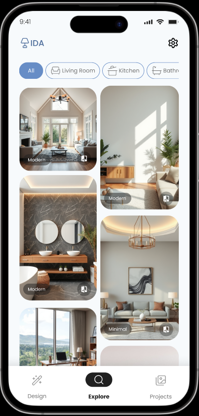
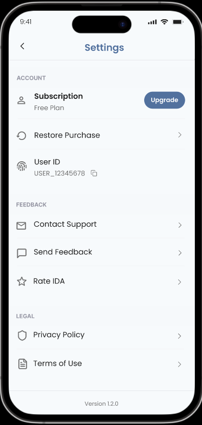

# Interior Design AI App

**Interior Design AI** is a Flutter-based mobile application that helps users visualize and experiment with interior design changes using AI technology.
This repository showcases my work as a **Flutter developer** on the Interior Design AI project.

---

## 📱 About the App

Interior Design AI is a powerful tool that allows users to:
- Add or replace furniture in room photos
- Paint walls with different colors
- Change floor designs
- Explore different room styles and designs
- Save and manage multiple design projects
- Share design results

The app uses advanced AI technology to transform interior spaces, making it easy for users to visualize changes before implementing them.

## 📌 Key Highlights

- AI-powered interior design transformations
- Clean and maintainable Flutter codebase using modern architecture
- Smooth user experience with custom animations and transitions
- Efficient state management with Riverpod
- Comprehensive error handling and logging
- Image processing and manipulation capabilities
- Project management and storage features
- Rich UI with custom components and layouts

---

## 🛠️ Tech Stack & Dependencies

Here's a summary of the main technologies and packages used in the project:

| Category | Package |
| ---------------- | ------------------------------- |
| **State Management** | [Riverpod](https://pub.dev/packages/flutter_riverpod), [Hooks](https://pub.dev/packages/flutter_hooks), [Riverpod Annotation](https://pub.dev/packages/riverpod_annotation) |
| **Routing** | [GoRouter](https://pub.dev/packages/go_router) |
| **HTTP Client** | [Dio](https://pub.dev/packages/dio), [Pretty Dio Logger](https://pub.dev/packages/pretty_dio_logger), [Retrofit](https://pub.dev/packages/retrofit) |
| **Storage** | [Path Provider](https://pub.dev/packages/path_provider), [Hive CE](https://pub.dev/packages/hive_ce) |
| **Utils** | [GetIt](https://pub.dev/packages/get_it), [Logger](https://pub.dev/packages/logger), [Collection](https://pub.dev/packages/collection), [RxDart](https://pub.dev/packages/rxdart) |
| **Code Generation** | [Freezed](https://pub.dev/packages/freezed), [JSON Serializable](https://pub.dev/packages/json_serializable), [Build Runner](https://pub.dev/packages/build_runner), [Retrofit Generator](https://pub.dev/packages/retrofit_generator), [Hive CE Generator](https://pub.dev/packages/hive_ce_generator) |
| **UI Components** | [Flutter Staggered Grid View](https://pub.dev/packages/flutter_staggered_grid_view), [Flutter Painter V2](https://pub.dev/packages/flutter_painter_v2), [Image Painter](https://pub.dev/packages/image_painter), [Dotted Border](https://pub.dev/packages/dotted_border), [Flutter SVG](https://pub.dev/packages/flutter_svg) |
| **Media & Images** | [Image Picker](https://pub.dev/packages/image_picker), [Saver Gallery](https://pub.dev/packages/saver_gallery), [Image](https://pub.dev/packages/image), [Video Player](https://pub.dev/packages/video_player), [Share Plus](https://pub.dev/packages/share_plus) |
| **UI/UX** | [Material Design Icons](https://pub.dev/packages/material_design_icons_flutter), [Fluttertoast](https://pub.dev/packages/fluttertoast), [Transparent Image](https://pub.dev/packages/transparent_image) |
| **Platform & Info** | [URL Launcher](https://pub.dev/packages/url_launcher), [Package Info Plus](https://pub.dev/packages/package_info_plus) |
| **Monetization** | [Purchases Flutter](https://pub.dev/packages/purchases_flutter), [Purchases UI Flutter](https://pub.dev/packages/purchases_ui_flutter) |
| **Development** | [Flutter Lints](https://pub.dev/packages/flutter_lints), [Custom Lint](https://pub.dev/packages/custom_lint), [Flutter Gen](https://pub.dev/packages/flutter_gen) |
| **Localization** | [Flutter Localization](https://pub.dev/packages/flutter_localization) |

---

## 🗂️ Project Structure

```
lib/
 ├── components/       # Reusable UI components
 ├── db/              # Database related code
 ├── extensions/      # Dart extensions
 ├── generated/       # Generated code
 ├── hooks/           # Custom Flutter hooks
 ├── mixins/         # Shared functionality
 ├── models/         # Data models
 ├── pages/          # Application screens
 ├── services/       # Business logic services
 ├── shared/         # Shared utilities
 ├── states/         # State management
 ├── utils/          # Utility functions
 ├── constant.dart   # App constants
 ├── deps.dart       # Dependency injection
 ├── main.dart       # App entry point
 ├── rest_client.dart # API client
 └── routes.dart     # App routing
```

## 📸 Screenshots

The app includes multiple key screens for different functionalities:
| Screen | Screenshot |
| ------ | ----------- |
| Home |  |
| Image |  |
| Mask |  |
| Paint Wall |  |
| Change Floor |  |
| Remove |  |
| Redesign |  |
| Result |  |
| Project |  |
| Explore |  |
| Settings |  |

## 📄 License

This is a proprietary project. All rights reserved.

---

## 🔄 Dev Setup

For development:
- Flutter SDK: 3.29.3
- Dart SDK: 3.7.2
- VS Code or Android Studio with Flutter plugins

_For more information about the app's features and development, please contact the development team._
